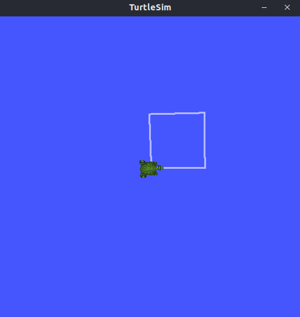

# Turtle Challenge

This challenge is meant to introduce some basic ROS concepts to new users, however it assumes you’re familiar with fundamental ROS concepts, including creating and building packages and running nodes.

The task is to develop a ROS node to control a turtle. The node must be capable of guiding the turtle to form a square in the turtlesim simulator. 




## How to develop the challenge

The challenge node should publish [Twist](https://docs.ros.org/en/noetic/api/geometry_msgs/html/msg/Twist.html) messages in the /turtle1/cmd_vel topic in order to make the turtle form a square.

To implement this behavior, you should modify the execute() method of the ChallengeNode node provided in this repository. Then run the simulator:

```bash
cd fbot_ws
source install/setup.bash
ros2 run turtlesim turtlesim_node
```

And the node: 

```bash
ros2 run turtle_challenge challenge_node
```

## Credits

Made and mantained by [Gabriel Dorneles](https://github.com/gadorneles) 